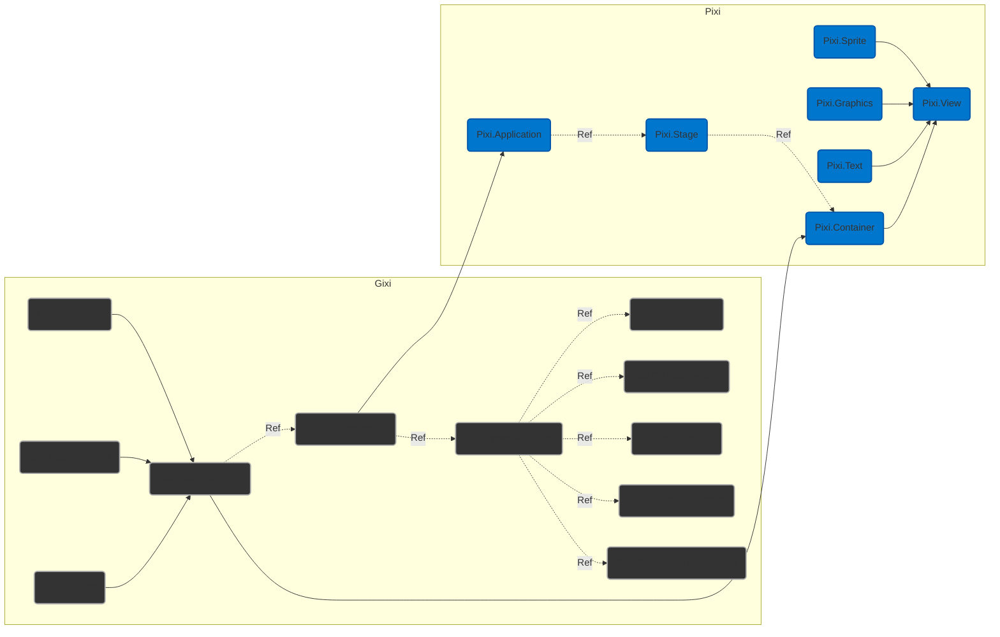

# Diagram

```mermaid
%%{
  init: {
    'theme': 'dark',
  }
}%%

flowchart LR

subgraph PixiNamespace ["Pixi"]
  classDef pixi fill:#0077cc,stroke:#0055aa,stroke-width:2px;

  %% ///////////////////////////////////////////////////
  %% Pixi.Stage
  %% ///////////////////////////////////////////////////
  PixiStage("Pixi.Stage"):::pixi -.->|Ref| PixiContainer

  %% ///////////////////////////////////////////////////
  %% Pixi.View
  %% ///////////////////////////////////////////////////
  PixiView("Pixi.View"):::pixi
  PixiSprite("Pixi.Sprite"):::pixi --> PixiView
  PixiGraphics("Pixi.Graphics"):::pixi --> PixiView
  PixiText("Pixi.Text"):::pixi --> PixiView
  PixiContainer("Pixi.Container"):::pixi --> PixiView

  %% ///////////////////////////////////////////////////
  %% Pixi.Application
  %% ///////////////////////////////////////////////////
  PixiApp("Pixi.Application"):::pixi -.->|Ref| PixiStage
end

subgraph GixiNamespace ["Gixi"]
  classDef gixi fill:#333,stroke:#aaa,stroke-width:2px;

  %% ///////////////////////////////////////////////////
  %% GixiActorContainer
  %% ///////////////////////////////////////////////////
  GixiActorContainer:::gixi -.->|Ref| GixiApplication

  %% ///////////////////////////////////////////////////
  %% GixiActorContainer
  %% ///////////////////////////////////////////////////
  GixiActorContainer("Gixi.ActorContainer"):::gixi --> PixiContainer
  ActorStatic("Gixi.ActorStatic"):::gixi --> GixiActorContainer
  ActorAnimated("Gixi.ActorAnimated"):::gixi --> GixiActorContainer
  Tilemap("Gixi.Tilemap"):::gixi --> GixiActorContainer

  %% ///////////////////////////////////////////////////
  %% GixiApplication
  %% ///////////////////////////////////////////////////
  GixiApplication("Gixi.GixiApplication"):::gixi --> PixiApp
  GixiApplication:::gixi -.->|Ref| GixiSystemManager

  %% ///////////////////////////////////////////////////
  %% GixiSystemManager
  %% ///////////////////////////////////////////////////
  GixiSystemManager("Gixi.SystemManager"):::gixi -.->|Ref| GixiAudioSystem
  GixiSystemManager:::gixi -.->|Ref| GixiCollisionSystem
  GixiSystemManager:::gixi -.->|Ref| GixiInputSystem
  GixiSystemManager:::gixi -.->|Ref| GixiMultiplayerSystem
  GixiSystemManager:::gixi -.->|Ref| GixiTilemapCollisionSystem

  %% ///////////////////////////////////////////////////
  %% List of systems
  %% ///////////////////////////////////////////////////
  GixiAudioSystem("Gixi.AudioSystem"):::gixi
  GixiCollisionSystem("Gixi.CollisionSystem"):::gixi
  GixiInputSystem("Gixi.InputSystem"):::gixi
  GixiMultiplayerSystem("Gixi.MultiplayerSystem"):::gixi
  GixiTilemapCollisionSystem("Gixi.TilemapCollisionSystem"):::gixi
end

```

---
