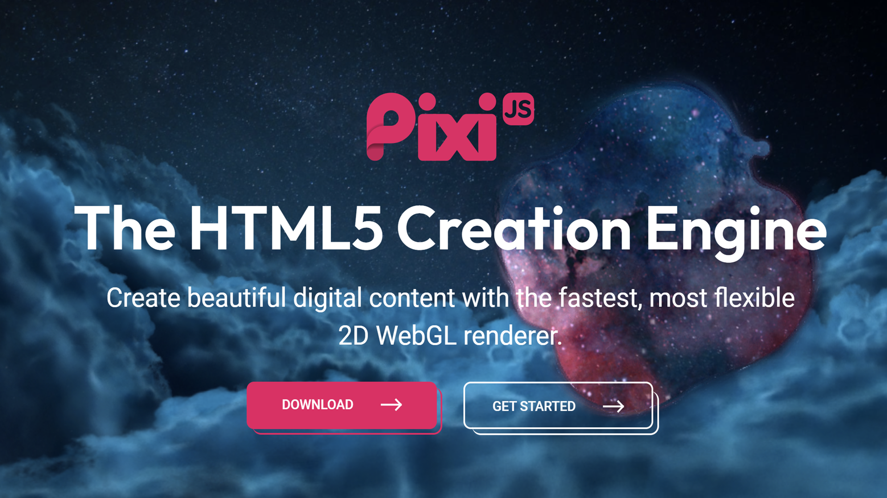

# PixiJS Jam #1

This repo includes Html5 examples using [PixiJS](https://pixijs.com/) and [TypeScript](https://www.typescriptlang.org/).


### Play (Old, Broken Build)

* [https://samuelasherrivello.github.io/pixi-jam-1/PixiJS/dist/index.html](https://samuelasherrivello.github.io/pixi-jam-1/PixiJS/dist/index.html)


### Build

**Client Instructions - WIP**

```
> npm install

> npm run build

> npm run start
```

**Server Instructions - WIP**

```
> npm run server-start
```


### More

It is based on Samuel Asher Rivello's [pixi-project-template](https://github.com/SamuelAsherRivello/pixi-project-template) which is a recommended starting point for new projects.
<figure>
    
    <figcaption>Image 1 - PixiJS Game Engine - Html5 + WebGPU</figcaption>
</figure>

<BR>

# Credits

**Created By**

- Samuel Asher Rivello 
- Over 25 years XP with game development (2024)
- Over 11 years XP with Unity (2024)

**Contact**

- Twitter - <a href="https://twitter.com/srivello/">@srivello</a>
- Git - <a href="https://github.com/SamuelAsherRivello/">Github.com/SamuelAsherRivello</a>
- Resume & Portfolio - <a href="http://www.SamuelAsherRivello.com">SamuelAsherRivello.com</a>
- LinkedIn - <a href="https://Linkedin.com/in/SamuelAsherRivello">Linkedin.com/in/SamuelAsherRivello</a> <--- Say Hello! :)

**License**

Provided as-is under MIT License | Copyright © 2024 Rivello Multimedia Consulting, LLC
